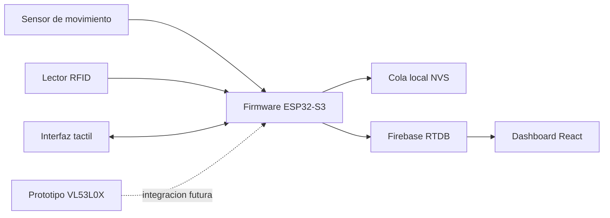

# Sistema de Entrenamiento Adaptativo SmartGym

Idioma: [English](README.md) | Espanol

SmartGym es un prototipo de entrenamiento adaptativo con ESP32-S3 para maquinas de gimnasio selectorizadas. Combina identificacion de usuario por RFID, interfaz tactil con LVGL, seguimiento de rango de movimiento, deteccion de repeticiones y series, calibracion guiada, recomendaciones de carga por usuario, sincronizacion con Firebase Realtime Database, un dashboard en React y un prototipo separado de deteccion de peso.

El proyecto de firmware PlatformIO permanece en la raiz del repositorio para conservar los comandos de build existentes. Los recursos complementarios estan organizados en `dashboard/`, `weight_detection/`, `docs/`, `hardware/` y `screenshots/`.

## Empieza Aqui

Si eres nuevo en el proyecto, empieza con [docs/START_HERE.es.md](docs/START_HERE.es.md). Ese documento explica que leer primero, donde vive cada subsistema y como viajan los datos desde sensores hasta Firebase y el dashboard.

Rutas rapidas:

| Objetivo | Abrir |
| --- | --- |
| Compilar y subir firmware | [Guia de desarrollador](docs/DEVELOPER_GUIDE.es.md) |
| Entender ROM, calibracion, formulas y errores | [Guia de medicion y calibracion](docs/MEASUREMENT_AND_CALIBRATION_GUIDE.es.md) |
| Usar el dispositivo en demo | [Manual de usuario](docs/USER_MANUAL.es.md) |
| Configurar Firebase y entender rutas de subida | [Guia de Firebase](docs/FIREBASE_GUIDE.es.md) |
| Entender datos seed/demo del dashboard | [Guia de seed Firebase para dashboard](docs/FIREBASE_DASHBOARD_SEED_GUIDE.es.md) |
| Encontrar archivos CAD/STL | [hardware/cad/README.es.md](hardware/cad/README.es.md) |
| Ejecutar el dashboard web | [dashboard/README.es.md](dashboard/README.es.md) |
| Probar el prototipo VL53L0X | [weight_detection/README.es.md](weight_detection/README.es.md) |

## Funciones Principales

- Identificacion de usuario por RFID con MFRC522.
- Interfaz tactil ESP32-S3 usando LVGL.
- Seguimiento analogico de ROM con muestreo cada 5 ms, aproximadamente 200 Hz.
- Grafica de movimiento en vivo actualizada aproximadamente cada 16 ms, cerca de 60 Hz.
- Deteccion de repeticiones y series a partir de ROM normalizado.
- Calibracion guiada para ROM y recomendaciones especificas por usuario.
- Modelo manual de carga de pin de maquina: el usuario actualiza el valor fisico con botones.
- Carga recomendada separada y especifica por usuario.
- Sincronizacion con Firebase RTDB para perfiles, calibraciones, sesiones, resumenes y heartbeat del dispositivo.
- Cola local en NVS para reintentos y comportamiento offline.
- Dashboard web para datos de entrenamiento en Firebase.
- Modulo separado de prototipo VL53L0X para deteccion de peso.

## Arquitectura



El firmware lee movimiento, normaliza ROM, detecta repeticiones, registra sesiones, calcula metricas de resumen, actualiza recomendaciones, guarda subidas pendientes localmente y sincroniza con Firebase. El dashboard lee rutas de Firebase para visualizar historial de entrenamiento.

## Hardware

- Pantalla ESP32-S3 VIEWE de 7 pulgadas.
- Pantalla tactil RGB soportada por ESP32 Display Panel y LVGL.
- Lector RFID MFRC522.
- Sensor analogico de movimiento/posicion conectado a GPIO 17.
- Sensor VL53L0X opcional para el prototipo de deteccion de peso.
- Maquina selectorizada con pin fisico de peso.
- Red Wi-Fi con acceso a Firebase RTDB.

## Stack de Software

- PlatformIO.
- Arduino framework para ESP32.
- LVGL 8.4.0.
- ESP32_Display_Panel y ESP32_IO_Expander.
- MFRC522.
- FirebaseClient y ESP_SSLClient.
- React, Vite, Firebase Web SDK y Recharts para el dashboard.

## Estructura del Repositorio

```text
.
|-- boards/                 Definicion de board PlatformIO
|-- dashboard/              Dashboard React/Vite con Firebase
|-- docs/                   Guias de uso, arquitectura, calibracion, Firebase y troubleshooting
|-- firebase_seed/          Archivos seed/importacion segura para Firebase
|-- hardware/               Notas de cableado y CAD
|-- lib/                    Librerias/modulos del firmware
|-- sample_data/            Datos de ejemplo para Firebase/dashboard
|-- screenshots/            Capturas o fotos de demo
|-- scripts/                Scripts utilitarios
|-- src/                    Codigo de aplicacion firmware
|-- tools/                  Herramientas locales
|-- weight_detection/       Prototipo VL53L0X separado
|-- platformio.ini          Configuracion de build firmware
`-- README.md
```

## Para Que Sirve Cada Carpeta

| Carpeta | Proposito |
| --- | --- |
| `src/` y `lib/` | Firmware ESP32-S3 y modulos de soporte. |
| `docs/` | Guias de uso, arquitectura, calibracion, Firebase y troubleshooting. |
| `hardware/` | Notas de cableado y archivos CAD/STL. |
| `dashboard/` | Dashboard React/Vite que lee datos de Firebase. |
| `firebase_seed/` | Archivos seed/importacion segura para Firebase e instrucciones. |
| `weight_detection/` | Sketch independiente VL53L0X para experimentos de deteccion de peso. |
| `sample_data/` | Datos de ejemplo para pruebas y demos. |
| `screenshots/` | Fotos de demo, capturas de UI/dashboard e imagenes de cableado. |
| `tools/` y `scripts/` | Herramientas locales de generacion, validacion y documentacion. |

## Documentacion

El paquete completo esta indexado en [docs/README.es.md](docs/README.es.md).

Documentos principales:

- [Manual de usuario](docs/USER_MANUAL.es.md)
- [Arquitectura del sistema](docs/SYSTEM_ARCHITECTURE.es.md)
- [Guia de desarrollador](docs/DEVELOPER_GUIDE.es.md)
- [Guia de medicion y calibracion](docs/MEASUREMENT_AND_CALIBRATION_GUIDE.es.md)
- [Guia de Firebase](docs/FIREBASE_GUIDE.es.md)
- [Guia de seed Firebase para dashboard](docs/FIREBASE_DASHBOARD_SEED_GUIDE.es.md)
- [Guia de troubleshooting](docs/TROUBLESHOOTING.es.md)

## Inicio Rapido

### Firmware

Instala PlatformIO, conecta la pantalla ESP32-S3 y compila:

```powershell
python -m platformio run --environment BOARD_VIEWE_UEDX80480070E_WB_A
```

Sube y abre monitor serial:

```powershell
python -m platformio run --target upload --target monitor --environment BOARD_VIEWE_UEDX80480070E_WB_A
```

### Dashboard

```powershell
cd dashboard
npm install
copy .env.example .env
npm run dev
```

Llena `.env` con la configuracion web real de Firebase antes de correrlo. El dashboard lee datos como `usersByRfid` y `athleteWeeklySessions`.

### Prototipo de Deteccion de Peso

El prototipo VL53L0X esta en `weight_detection/`. No esta mezclado con el firmware principal. Usalo como sketch Arduino separado para validar deteccion optica/de distancia en el stack de pesas.

## Uso del Dispositivo

1. Enciende la pantalla ESP32.
2. Espera UI, Wi-Fi, Firebase, RFID y servicios de tiempo.
3. Escanea una tarjeta RFID.
4. Espera a que termine la carga de perfil, calibracion, recomendacion y ROM.
5. Revisa carga de pin y carga recomendada.
6. Ajusta fisicamente el pin de la maquina si hace falta y actualiza el valor en pantalla.
7. Presiona START.
8. Sigue la grafica de movimiento y las pistas de tiempo.
9. Termina el entrenamiento o deja que se completen las series objetivo.
10. Revisa el resumen mientras la sesion se sincroniza.

## Calibracion

La calibracion es especifica por usuario y tipo de maquina. Registra repeticiones limpias en una o mas cargas, estima ROM y calidad de desempeno, y guarda recomendaciones bajo `calibrations/{uid}/{machineTypeId}`. El software nunca mueve fisicamente el pin: el usuario ajusta la maquina y confirma el valor mostrado.

Para formulas, normalizacion de ROM, flujo de calibracion, errores y validacion, consulta [docs/MEASUREMENT_AND_CALIBRATION_GUIDE.es.md](docs/MEASUREMENT_AND_CALIBRATION_GUIDE.es.md).

## Modelo de Datos

Nodos principales de Firebase:

- `usersByRfid/{uid}`
- `calibrations/{uid}/{machineTypeId}`
- `machineConfigs/{machineId}`
- `athleteWeeklySessions/{uid}/{weekKey}/days/{dayKey}`
- `devices/{deviceId}`

Las subidas de sesion incluyen raiz de sesion, metadata diaria, timeline, resumenes dia/semana, repeticiones representativas, detalles de series y repeticiones por set bajo `repSets`.

## Limitaciones Conocidas

- El firmware principal usa un modelo manual de carga de pin.
- Las escrituras Firebase/TLS son sensibles a memoria en ESP32-S3, por lo que se usan cola y fragmentacion.
- La configuracion Firebase del dashboard se carga desde variables locales y no debe commitearse.
- El modulo de deteccion de peso requiere calibracion especifica por maquina.

## Mejoras Futuras

- Integrar deteccion fisica de peso despues de validarla.
- Agregar reglas de seguridad Firebase y flujo de autenticacion de produccion.
- Agregar pruebas de integracion de firmware donde sea practico.
- Agregar instrucciones de despliegue del dashboard y capturas.
- Agregar diagramas de cableado especificos por maquina.
