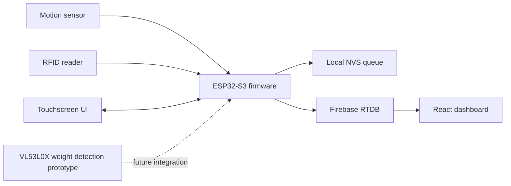

# SmartGym Adaptive Training System

Language: English | [Espanol](README.es.md)

SmartGym is an ESP32-S3 adaptive training prototype for selectorized gym machines. It combines RFID user identification, a touchscreen LVGL interface, range-of-motion tracking, rep and set detection, guided calibration, user-specific load recommendations, Firebase Realtime Database synchronization, a React dashboard, and a separate weight-detection prototype.

The current repository keeps the PlatformIO firmware project at the repository root so the existing build commands and include paths continue to work. Companion project assets are organized in `dashboard/`, `weight_detection/`, `docs/`, `hardware/`, and `screenshots/`.

## Start Here

If you are new to the project, start with [docs/START_HERE.md](docs/START_HERE.md). It explains what to read first, where every subsystem lives, and how the data flows from sensors to Firebase and the dashboard.

Fast paths:

| Goal | Open |
| --- | --- |
| Build and upload firmware | [Developer Guide](docs/DEVELOPER_GUIDE.md) |
| Understand ROM, calibration, equations, and error sources | [Measurement and Calibration Guide](docs/MEASUREMENT_AND_CALIBRATION_GUIDE.md) |
| Use the device in a demo | [User Manual](docs/USER_MANUAL.md) |
| Configure Firebase and understand upload paths | [Firebase Guide](docs/FIREBASE_GUIDE.md) |
| Understand dashboard seed/test data | [Firebase Dashboard Seed Guide](docs/FIREBASE_DASHBOARD_SEED_GUIDE.md) |
| Find CAD/STL hardware files | [hardware/cad/README.md](hardware/cad/README.md) |
| Run the web dashboard | [dashboard/README.md](dashboard/README.md) |
| Test the VL53L0X prototype | [weight_detection/README.md](weight_detection/README.md) |

## Key Features

- RFID user identification with MFRC522.
- ESP32-S3 touchscreen interface using LVGL.
- Analog ROM tracking with 5 ms sensor sampling, approximately 200 Hz.
- Live motion graph refreshed at approximately 16 ms, about 60 Hz.
- Rep and set detection from normalized ROM.
- Guided calibration for user-specific ROM and load recommendations.
- Manual machine pin load model: the user updates the physical pin value with buttons.
- Separate user-specific recommended load.
- Firebase RTDB sync for profiles, calibration, sessions, summaries, and device heartbeat.
- Local NVS upload queue for offline/retry behavior.
- Web dashboard for Firebase workout data.
- Separate VL53L0X weight-detection prototype module.

## System Architecture



The firmware reads motion, normalizes ROM, detects reps, records sessions, computes summary metrics, updates recommendations, stores pending uploads locally, and synchronizes with Firebase. The dashboard reads Firebase paths to visualize user training history.

## Hardware List

- ESP32-S3 VIEWE 7 inch display board.
- RGB touchscreen display supported by ESP32 Display Panel and LVGL.
- MFRC522 RFID reader.
- Analog motion/position sensor connected to GPIO 17.
- Optional VL53L0X distance sensor for the teammate weight-detection prototype.
- Selectorized gym machine with physical weight pin.
- Wi-Fi network with Firebase RTDB access.

## Software Stack

- PlatformIO.
- Arduino framework for ESP32.
- LVGL 8.4.0.
- ESP32_Display_Panel and ESP32_IO_Expander.
- MFRC522.
- FirebaseClient and ESP_SSLClient.
- React, Vite, Firebase Web SDK, and Recharts for the dashboard.

## Repository Structure

```text
.
|-- boards/                 PlatformIO board definition
|-- dashboard/              Teammate React/Vite Firebase dashboard
|-- docs/                   User, developer, Firebase, architecture, troubleshooting docs
|-- firebase_seed/          Safe Firebase seed/import artifacts
|-- hardware/               Wiring and sensor notes
|-- lib/                    Firmware libraries
|-- sample_data/            Firebase/sample data artifacts
|-- screenshots/            Screenshots or demo photos
|-- scripts/                Utility scripts
|-- src/                    Firmware application source
|-- tools/                  Local tooling
|-- weight_detection/       Teammate VL53L0X weight-detection prototype
|-- platformio.ini          Firmware build configuration
`-- README.md
```

## What Each Folder Is For

| Folder | Purpose |
| --- | --- |
| `src/` and `lib/` | ESP32-S3 firmware application and support modules. |
| `docs/` | Human-readable guides for usage, architecture, calibration, Firebase, and troubleshooting. |
| `hardware/` | Wiring notes plus CAD/STL files for mounts, enclosure parts, and ToF hardware. |
| `dashboard/` | React/Vite dashboard that reads Firebase workout data. |
| `firebase_seed/` | Safe Firebase seed/import artifacts and import instructions. |
| `weight_detection/` | Standalone VL53L0X prototype sketch for weight-stack detection experiments. |
| `sample_data/` | Firebase/sample data artifacts used for testing and dashboard demos. |
| `screenshots/` | Demo photos, UI screenshots, dashboard captures, and wiring images. |
| `tools/` and `scripts/` | Local generation, validation, and documentation utilities. |

## Documentation

The full documentation package is indexed in [docs/README.md](docs/README.md).

Most important PDFs:

- [User Manual](docs/USER_MANUAL.pdf)
- [System Architecture](docs/SYSTEM_ARCHITECTURE.pdf)
- [Developer Guide](docs/DEVELOPER_GUIDE.pdf)
- [Measurement and Calibration Guide](docs/MEASUREMENT_AND_CALIBRATION_GUIDE.md)
- [Firebase Guide](docs/FIREBASE_GUIDE.pdf)
- [Firebase Dashboard Seed Guide](docs/FIREBASE_DASHBOARD_SEED_GUIDE.md)
- [Troubleshooting Guide](docs/TROUBLESHOOTING.pdf)

## Quick Start

### Firmware

Install PlatformIO, connect the ESP32-S3 display board, then build:

```powershell
python -m platformio run --environment BOARD_VIEWE_UEDX80480070E_WB_A
```

Upload and monitor:

```powershell
python -m platformio run --target upload --target monitor --environment BOARD_VIEWE_UEDX80480070E_WB_A
```

### Dashboard

```powershell
cd dashboard
npm install
copy .env.example .env
npm run dev
```

Fill `.env` with the Firebase web config before running. Open the local Vite URL shown in the terminal. The dashboard reads Firebase RTDB data such as `usersByRfid` and `athleteWeeklySessions`.

### Weight Detection Prototype

The VL53L0X prototype is in `weight_detection/`. It is not merged into the firmware. Use it as a separate Arduino sketch for validating optical/distance-based weight-stack detection.

## Device Usage Overview

1. Power on the ESP32 display.
2. Wait for UI, Wi-Fi, Firebase, RFID, and time services.
3. Scan an RFID card.
4. Wait until the loading popup finishes profile, calibration, recommendation, and ROM mapping.
5. Check the pin load and recommended load.
6. Physically move the machine pin if desired, then update the pin load with the four buttons.
7. Press START.
8. Follow the motion graph and timing cues.
9. Finish the workout or let target sets complete.
10. Review the summary while the session syncs.

## Calibration Overview

Calibration is user-specific and machine-type-specific. It records clean reps at one or more loads, estimates ROM and performance quality, and saves recommended loads under `calibrations/{uid}/{machineTypeId}`. The physical pin is never moved automatically by software; the user adjusts the machine pin and confirms the displayed pin load.

For the full signal path, formulas, ROM normalization logic, calibration flow,
error sources, and validation steps, see
[docs/MEASUREMENT_AND_CALIBRATION_GUIDE.md](docs/MEASUREMENT_AND_CALIBRATION_GUIDE.md).

## Data Model Overview

Primary Firebase nodes:

- `usersByRfid/{uid}`
- `calibrations/{uid}/{machineTypeId}`
- `machineConfigs/{machineId}`
- `athleteWeeklySessions/{uid}/{weekKey}/days/{dayKey}`
- `devices/{deviceId}`

Session uploads include a root session record, daily metadata, timeline entries, day/week summaries, representative reps, set details, and per-set rep details under `repSets`.

## Known Limitations

- The firmware currently uses a manual pin load model; there is no integrated physical weight sensor in the main firmware.
- Firebase/TLS writes are memory-sensitive on ESP32, so uploads are queued and chunked.
- Dashboard Firebase configuration is loaded from local environment variables and should not be committed.
- The weight-detection module is a prototype and requires machine-specific calibration.

## Future Improvements

- Integrate physical weight detection after validation.
- Add production Firebase security rules and auth flow.
- Add automated firmware integration tests where practical.
- Add dashboard deployment instructions and screenshots.
- Add machine-specific wiring diagrams.
