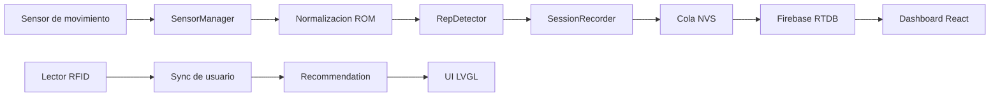
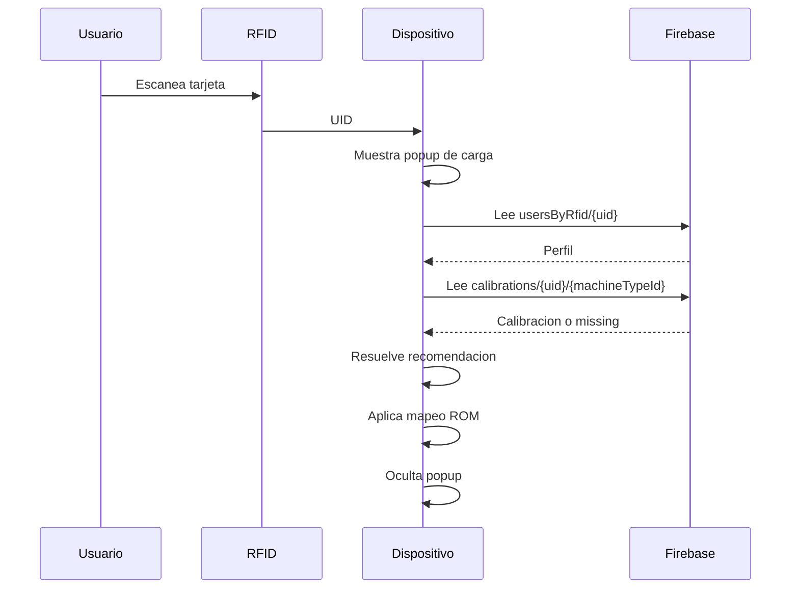
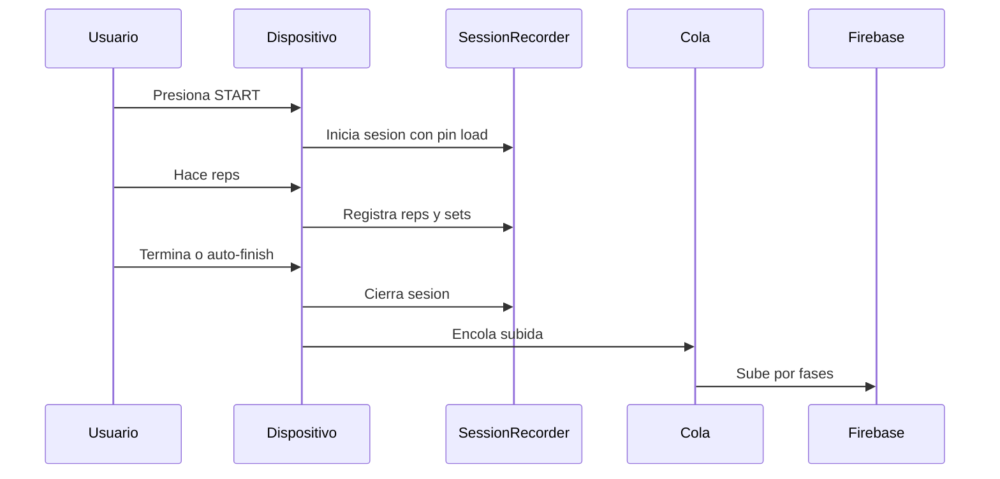

# Arquitectura Del Sistema SmartGym

Idioma: [English](SYSTEM_ARCHITECTURE.md) | Espanol

## Arquitectura General

El sistema se divide en firmware embebido, Firebase RTDB y visualizacion en dashboard.

## Flujo De Datos

1. El sensor se muestrea cada 5 ms.
2. `SensorManager` filtra el valor analogico.
3. El firmware convierte la lectura a porcentaje ROM.
4. La calibracion de usuario mapea ROM crudo a ROM normalizado.
5. `RepDetector` identifica fases y repeticiones completas.
6. `SessionRecorder` guarda reps, sets, peso, ROM, tiempos y calidad.
7. `SmartGymTouchApp` calcula resumen y recomendacion.
8. La cola de subida guarda payloads Firebase.
9. `FirebaseService` envia escrituras seguras a RTDB.
10. El dashboard lee Firebase para graficas y resumenes.

## Flujo De Login

Las entradas quedan bloqueadas hasta que el sync termina o cae a un fallback seguro.

## Flujo De Entrenamiento

## Pin Load Vs Recomendacion

Pin load es estado fisico de la maquina. Permanece con la maquina entre usuarios. La recomendacion es consejo especifico por usuario.

El firmware nunca cambia pin load por una recomendacion. El usuario mueve fisicamente el pin y actualiza la UI con botones.

## Calibracion

La calibracion usa el pin load actual y cargas sugeridas. El usuario confirma la carga fisica antes de recolectar reps. El firmware analiza repeticiones suaves, estima si la carga es adecuada y guarda datos de calibracion por usuario y maquina.

## Sync

El final de sesion agenda sync. Trabajo pesado de Firebase no ocurre dentro del cierre inmediato.

Fases:

- Core de sesion.
- Metadata.
- Timeline.
- Resumenes.
- Detalles.
- Rep sets.

La cola NVS permite reintentos y evita perdida de datos si Firebase o Wi-Fi fallan temporalmente.

## Frecuencias

- Tick principal: 4 ms.
- Muestreo sensor: 5 ms, aproximadamente 200 Hz.
- Grafica: 16 ms, aproximadamente 60 Hz.
- UI lenta: 140 ms.
- UI debug: 160 ms.
- Servicio cloud normal: 5000 ms.
- Cadencia de finish sync: aproximadamente 1200 ms.
- Heartbeat: 60000 ms.
- Timeout user sync: 12000 ms.

## Estrategia De Memoria

El ESP32-S3 tiene poca memoria durante escrituras TLS/Firebase. El firmware mide heap interno y bloque interno mas grande, y elige modo:

- Normal: payloads mas grandes.
- Constrained: payloads pequenos y repSets fragmentados.
- Critical: payloads muy pequenos o backoff.

Objetos LVGL opcionales se liberan antes de entrenamiento/subida para mejorar heap disponible.
