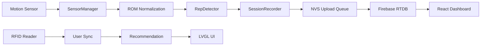
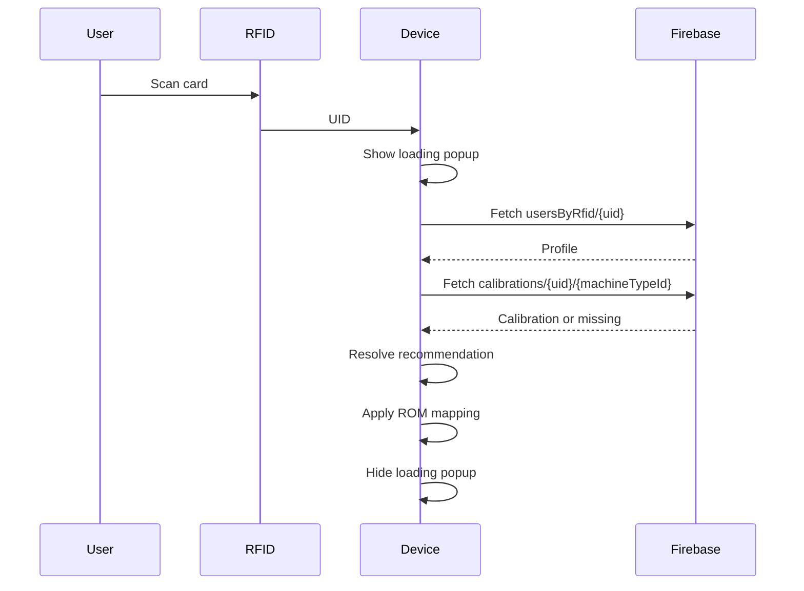
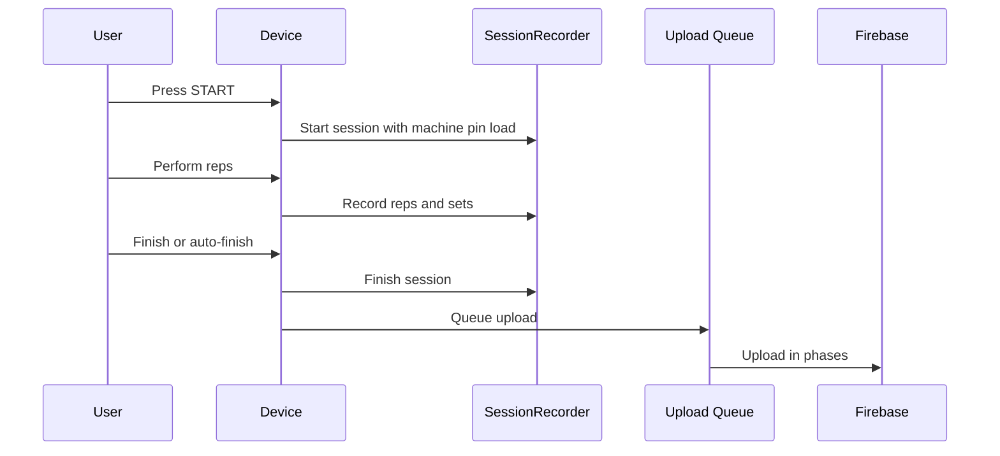

# SmartGym System Architecture

## High-Level Architecture

The system is split into embedded firmware, Firebase RTDB, and dashboard visualization.

## Data Flow

1. Sensor is sampled every 5 ms.
2. SensorManager filters the analog value.
3. Firmware converts sensor reading to ROM percentage.
4. User calibration maps raw ROM into user-normalized ROM.
5. RepDetector identifies rep phases and completed reps.
6. SessionRecorder stores reps, sets, weight, ROM, timing, and quality.
7. SmartGymTouchApp computes summary/recommendation updates.
8. Upload queue stores Firebase payloads.
9. FirebaseService sends memory-safe writes to RTDB.
10. Dashboard reads Firebase for charts and summaries.

## User Login Flow

Inputs are blocked until sync completes or falls back safely.

## Workout Flow

## Manual Pin Load vs Recommendation

Pin load is physical machine state. It stays with the machine across users. Recommendation is user-specific advice.

The firmware never changes pin load because of recommendation. The user physically changes the machine pin and updates the UI with weight buttons.

## Calibration Flow

Calibration uses the current machine pin load and suggested loads. The user confirms the physical load before collecting reps. The firmware analyzes smooth reps, estimates load suitability, and saves user-machine calibration data.

## Sync Flow

Session finish schedules sync. Heavy Firebase work is not performed inside the immediate finish path.

Sync writes:

- Core session.
- Metadata.
- Timeline.
- Summaries.
- Details.
- Rep sets.

The NVS queue allows retry and prevents data loss when Firebase or Wi-Fi is temporarily unavailable.

## Sampling and Refresh Rates

- Main app tick: 4 ms.
- Sensor sample interval: 5 ms, approximately 200 Hz.
- Graph refresh: 16 ms, approximately 60 Hz.
- Slow UI refresh: 140 ms.
- Debug UI refresh: 160 ms.
- Normal cloud service cadence: 5000 ms.
- Summary/cloud finish cadence: approximately 1200 ms.
- Device heartbeat interval: 60000 ms.
- User sync timeout: 12000 ms.

## Memory Strategy

The ESP32 is memory-constrained during TLS/Firebase writes. The firmware tracks internal heap and largest internal block, then selects upload behavior:

- Normal: larger payloads.
- Constrained: smaller payloads and chunked repSets.
- Critical: very small payloads or backoff.

Optional LVGL UI objects are freed before training/upload to improve available heap.
